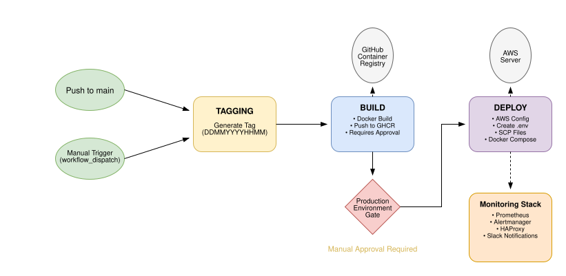

## Flask Web Application Overview
This is a simple message board application built on flask. It is deployed on AWS EC2 with a full CI/CD, IAC and monitoring.

### Web App approach
1. Built docker Container for consistency
2. HAProxy load balancer is used for proxying and load balancing 

### Infrastructure as Code with Terraform
Designed a complete AWS Infrastructure using Terraform. Components include:
1. VPC with public subnets across multiple AZs.
2. EC2 instance with security groups and Elastic IP attachment
3. SSH Key management as opposed to use of Passwords for login

### CI/CD pipeline using Github Actions
Implemented automated deployment pipeline with different stages:
1. **Build**: The docker image is build with version tagging based on time and date of the build
2. **Deploy**: Deploying to the previously built infrastructure by use of SSH

### Monitoring
Implementation of monitoring by use of prometheus and grafana. The following metrics are covered:
1. **System metrics** that is, CPU, memory usage and disk usage using node exporter
2. **container metrics** using cAdvisor
3. **Alerting** using slack as opposed to email

## Achievements
1. Use of github secrets for secret configs
2. Use of HAProxy for load balancing and proxying requests
3. Use of deployment gates for managing shipping into production
4. Service discovery on prometheus
5. Terraform actions triggered only on relevant file changes
6. Container restart policies and service monitoring
7. Restricted security groups and firewall rules

## Challenges
1. Including IAC on the build & deploy pipeline.
2. Message persistence on container restart as there is no DB currently
3. Dynamic SSH key generation
4. Terraform state persistence in CI/CD

### Pipeline Diagram
